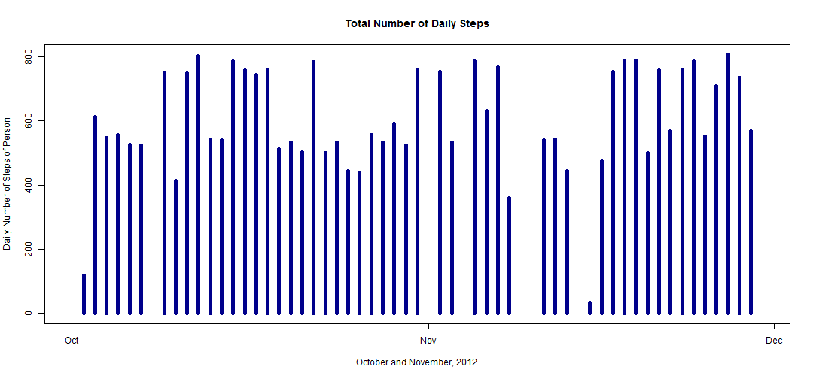

Activity Monitoring
===================

##Author: Karl Konz
Date: *Sunday, February 7, 2016*

Data 
----
The raw data for this report can be downloaded from this address <https://d396qusza40orc.cloudfront.net/repdata%2Fdata%2Factivity.zip>. Use the script below to download data.


## Loading and preprocessing the data


```r
MyData <- read.csv(file = "activity.csv", stringsAsFactors=FALSE, na.strings="NA")
```


```r
MyData$date <-strptime(MyData$date, "%Y-%m-%d")
```

## What is mean total number of steps taken per day?


```r
library(plyr)
m <-  ddply(MyData, c("date"), summarise, steps = mean(steps, na.rm=T))
```


```r
plot(m$date, m$steps, type = "h", main = "Mean Total Number of Daily Steps", ylab = "Daily Number of Steps of Person", xlab = "October and November, 2012", col="darkblue", lwd=5)
```



```r
m
```

```
##          date      steps
## 1  2012-10-01        NaN
## 2  2012-10-02  0.4375000
## 3  2012-10-03 39.4166667
## 4  2012-10-04 42.0694444
## 5  2012-10-05 46.1597222
## 6  2012-10-06 53.5416667
## 7  2012-10-07 38.2465278
## 8  2012-10-08        NaN
## 9  2012-10-09 44.4826389
## 10 2012-10-10 34.3750000
## 11 2012-10-11 35.7777778
## 12 2012-10-12 60.3541667
## 13 2012-10-13 43.1458333
## 14 2012-10-14 52.4236111
## 15 2012-10-15 35.2048611
## 16 2012-10-16 52.3750000
## 17 2012-10-17 46.7083333
## 18 2012-10-18 34.9166667
## 19 2012-10-19 41.0729167
## 20 2012-10-20 36.0937500
## 21 2012-10-21 30.6284722
## 22 2012-10-22 46.7361111
## 23 2012-10-23 30.9652778
## 24 2012-10-24 29.0104167
## 25 2012-10-25  8.6527778
## 26 2012-10-26 23.5347222
## 27 2012-10-27 35.1354167
## 28 2012-10-28 39.7847222
## 29 2012-10-29 17.4236111
## 30 2012-10-30 34.0937500
## 31 2012-10-31 53.5208333
## 32 2012-11-01        NaN
## 33 2012-11-02 36.8055556
## 34 2012-11-03 36.7048611
## 35 2012-11-04        NaN
## 36 2012-11-05 36.2465278
## 37 2012-11-06 28.9375000
## 38 2012-11-07 44.7326389
## 39 2012-11-08 11.1770833
## 40 2012-11-09        NaN
## 41 2012-11-10        NaN
## 42 2012-11-11 43.7777778
## 43 2012-11-12 37.3784722
## 44 2012-11-13 25.4722222
## 45 2012-11-14        NaN
## 46 2012-11-15  0.1423611
## 47 2012-11-16 18.8923611
## 48 2012-11-17 49.7881944
## 49 2012-11-18 52.4652778
## 50 2012-11-19 30.6979167
## 51 2012-11-20 15.5277778
## 52 2012-11-21 44.3993056
## 53 2012-11-22 70.9270833
## 54 2012-11-23 73.5902778
## 55 2012-11-24 50.2708333
## 56 2012-11-25 41.0902778
## 57 2012-11-26 38.7569444
## 58 2012-11-27 47.3819444
## 59 2012-11-28 35.3576389
## 60 2012-11-29 24.4687500
## 61 2012-11-30        NaN
```

## What is the average daily activity pattern?


```r
avgDailyStps <- sapply(split(MyData$steps, MyData$interval), mean, na.rm=TRUE)
```


```r
 plot(unique(MyData$interval), avgDailyStps, type = "l",  main = "Average Number of Steps", ylab = "Number of Steps", xlab = "5 min increments", col="darkblue")
```


## Imputing missing values


```r
trows <- nrow(MyData)
cAvgDailyStps <- rep(avgDailyStps, 61) 
nv <- vector()
leng <- 1:trows
for (i in leng) {
        ifelse (is.na(MyData$steps[i]), v <- cAvgDailyStps[i], v <- MyData$steps[i])
        nv <- c(nv, v)
}
```


```r
procdata <- MyData
procdata$steps <- nv
mprocdata <-  ddply(procdata, c("date"), summarise, steps = mean(steps))
```

Here is mean total number of steps taken per day with the missing values imputted.


```r
plot(mprocdata$date, mprocdata$steps, type = "h",main = "Mean Total Number Steps Taken Daily", ylab = "Number of steps", xlab = "October and November, 2012", col="darkblue", lwd=5)
```


```r
mprocdata
```

```
##          date      steps
## 1  2012-10-01 37.3825996
## 2  2012-10-02  0.4375000
## 3  2012-10-03 39.4166667
## 4  2012-10-04 42.0694444
## 5  2012-10-05 46.1597222
## 6  2012-10-06 53.5416667
## 7  2012-10-07 38.2465278
## 8  2012-10-08 37.3825996
## 9  2012-10-09 44.4826389
## 10 2012-10-10 34.3750000
## 11 2012-10-11 35.7777778
## 12 2012-10-12 60.3541667
## 13 2012-10-13 43.1458333
## 14 2012-10-14 52.4236111
## 15 2012-10-15 35.2048611
## 16 2012-10-16 52.3750000
## 17 2012-10-17 46.7083333
## 18 2012-10-18 34.9166667
## 19 2012-10-19 41.0729167
## 20 2012-10-20 36.0937500
## 21 2012-10-21 30.6284722
## 22 2012-10-22 46.7361111
## 23 2012-10-23 30.9652778
## 24 2012-10-24 29.0104167
## 25 2012-10-25  8.6527778
## 26 2012-10-26 23.5347222
## 27 2012-10-27 35.1354167
## 28 2012-10-28 39.7847222
## 29 2012-10-29 17.4236111
## 30 2012-10-30 34.0937500
## 31 2012-10-31 53.5208333
## 32 2012-11-01 37.3825996
## 33 2012-11-02 36.8055556
## 34 2012-11-03 36.7048611
## 35 2012-11-04 37.3825996
## 36 2012-11-05 36.2465278
## 37 2012-11-06 28.9375000
## 38 2012-11-07 44.7326389
## 39 2012-11-08 11.1770833
## 40 2012-11-09 37.3825996
## 41 2012-11-10 37.3825996
## 42 2012-11-11 43.7777778
## 43 2012-11-12 37.3784722
## 44 2012-11-13 25.4722222
## 45 2012-11-14 37.3825996
## 46 2012-11-15  0.1423611
## 47 2012-11-16 18.8923611
## 48 2012-11-17 49.7881944
## 49 2012-11-18 52.4652778
## 50 2012-11-19 30.6979167
## 51 2012-11-20 15.5277778
## 52 2012-11-21 44.3993056
## 53 2012-11-22 70.9270833
## 54 2012-11-23 73.5902778
## 55 2012-11-24 50.2708333
## 56 2012-11-25 41.0902778
## 57 2012-11-26 38.7569444
## 58 2012-11-27 47.3819444
## 59 2012-11-28 35.3576389
## 60 2012-11-29 24.4687500
## 61 2012-11-30 37.3825996
```

## Are there differences in activity patterns between weekdays and weekends?


```r
library("timeDate")
time <- procdata$date
weekend <- sapply(as.Date(time), isWeekend)
weekend <- gsub("TRUE", "weekend", weekend)
weekend <- gsub("FALSE", "weekday", weekend)
procdata <- cbind(procdata, weekend)
```


```r
library(lattice)
subd <- subset(procdata, procdata$weekend == "weekday")
sube <- subset(procdata, procdata$weekend == "weekend")
weekday <- sapply(split(subd$steps, subd$interval), mean)
weekend <- sapply(split(sube$steps, sube$interval), mean)
Interval <- names(weekday)
Interval <- as.integer(Interval)
stpswd <- as.numeric(weekday)
tmd <- c("weekday")
tmd <- rep(tmd, 288)
wd <- data.frame(Interval, stpswd, tmd)
stpswe <- as.numeric(weekend)
tme <- c("weekend")
tme <- rep(tme, 288)
we <- data.frame(Interval, stpswe, tme)
colnames(wd) <- c("Interval", "steps", "time")
colnames(we) <- c("Interval", "steps", "time")
data <- rbind(wd, we)
xyplot(steps ~ Interval | time, data = data, type = "l", 
       layout = c(1, 2), ylab = "Number of steps")
```


